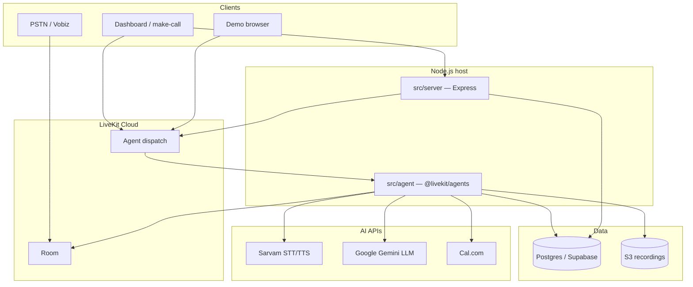
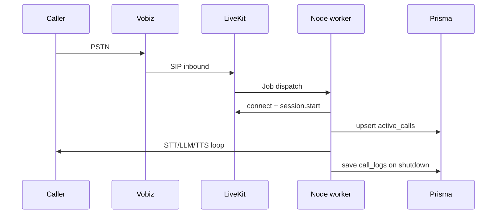
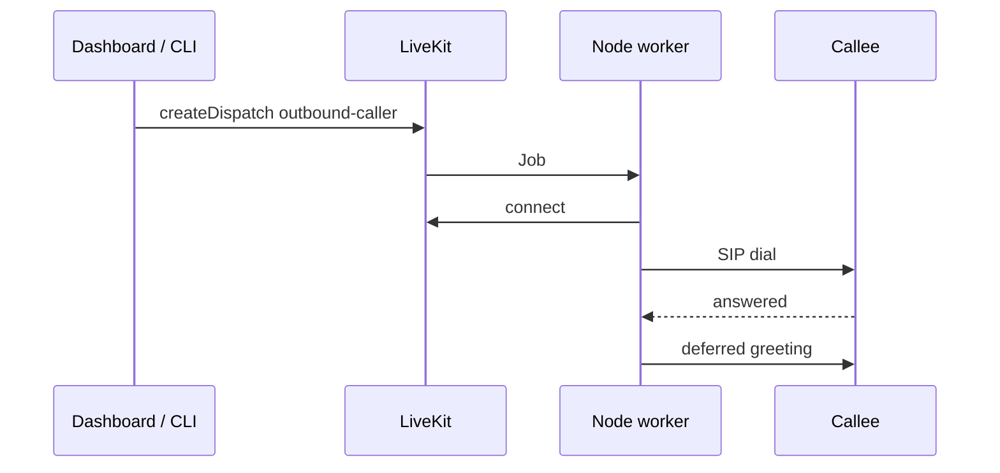

# Voice Agent Architecture

RapidX AI voice agent: **LiveKit** real-time audio, **Vobiz SIP** telephony, **Sarvam** STT/TTS, **Gemini** LLM, **Prisma** on Postgres (Supabase), and an **Express** dashboard.

See [README.md](README.md) for the documentation index. Database setup: [PRISMA_SETUP.md](PRISMA_SETUP.md).

## Runtime (TypeScript)

```
src/
├── agent/
│   ├── index.ts        # cli.runApp → LiveKit worker
│   ├── entrypoint.ts   # defineAgent — connect, SIP, session
│   ├── pipeline.ts     # STT / LLM / TTS + noise cancellation
│   ├── assistant.ts    # voice.Agent + greeting
│   ├── tools.ts        # llm.tool — transfer, booking, calendar
│   ├── events.ts       # turn limits, live transcripts
│   └── post-call.ts    # booking, sentiment, Prisma save
├── server/
│   └── index.ts        # REST API + static frontend/
└── lib/
    ├── config.ts       # config.json + per-phone overrides
    ├── dispatch.ts     # AgentDispatchClient
    ├── db.ts           # Prisma repositories
    ├── prisma.ts       # Prisma client singleton
    ├── call-types.ts   # inbound / outbound / demo
    ├── calendar.ts     # Cal.com v2
    ├── notify.ts       # Telegram / WhatsApp
    └── livekit-clients.ts  # SipClient, EgressClient

prisma/
├── schema.prisma       # call_logs, call_transcripts, active_calls
└── migrations/         # baseline SQL (idempotent)

frontend/               # Next.js dashboard + demo.html
scripts/                # make-call.ts, setup-trunk.ts
```

| Process | Command | Role |
|---------|---------|------|
| Agent worker | `npm run agent:dev` | Joins rooms, runs voice pipeline |
| Dashboard | `npm run server:dev` | `:8000` APIs + HTML |
| Outbound CLI | `npm run call -- +91…` | Explicit dispatch |

Worker registers as **`outbound-caller`** (`LIVEKIT_AGENT_NAME` or default in `src/lib/dispatch.ts`).

## High-level diagram



## Call flows

### Inbound

PSTN → Vobiz → LiveKit inbound trunk → room with SIP participant → dispatch **`outbound-caller`** → worker connects → `AgentSession` with inbound prompts → greeting (not deferred).



### Outbound

Dashboard / `npm run call` → `dispatchCall()` → agent joins room → `SipClient.createSipParticipant` (`waitUntilAnswered`) → greeting after answer.



### Demo

`GET /api/demo-token` → dispatch `call_type: demo` → JWT for **`livekit-client`** → browser joins room; no SIP dial.

## Post-call pipeline

On job shutdown (`ctx.addShutdownCallback`):

1. Cal.com booking if `save_booking_intent` was used
2. Telegram / WhatsApp notifications
3. Gemini sentiment (optional)
4. Stop egress → recording URL
5. `prisma.callLog.create` + `active_calls` status `completed`
6. Optional `N8N_WEBHOOK_URL` and `/internal/record-call` metrics

## API keys and config

Secrets in **`.env` only**. Behavior (prompts, models, delays) in **`config.json`** and optional **`configs/{phone}.json`**.

| Required | Variable |
|----------|----------|
| LiveKit | `LIVEKIT_URL`, `LIVEKIT_API_KEY`, `LIVEKIT_API_SECRET` |
| Voice AI | `GEMINI_API_KEY` (or `GOOGLE_API_KEY`), `SARVAM_API_KEY` |
| Database | `DATABASE_URL` (Neon direct — see [NEON_SETUP.md](NEON_SETUP.md)) |
| Outbound SIP | `OUTBOUND_TRUNK_ID`, `VOBIZ_*` |
| Recordings (optional) | `SUPABASE_S3_*`, `SUPABASE_URL` (public URL) |
| Booking (optional) | `CAL_API_KEY`, `CAL_EVENT_TYPE_ID` |
| Alerts (optional) | `TELEGRAM_*`, Twilio WhatsApp vars |

## LiveKit checklist

1. Inbound trunk + dispatch rule → agent name **`outbound-caller`**
2. Outbound trunk ID → `OUTBOUND_TRUNK_ID` in `.env`
3. Vobiz `inbound_destination` = LiveKit SIP URI **without** `sip:` prefix
4. Outbound trunk: configure via LiveKit console or `npm run setup:trunk`

## Database (Prisma)

| Model | Table | Purpose |
|-------|-------|---------|
| `CallLog` | `call_logs` | Completed calls, transcript, analytics |
| `CallTranscript` | `call_transcripts` | Live per-turn stream |
| `ActiveCall` | `active_calls` | In-progress status (+ `call_type`) |

Apply schema: [PRISMA_SETUP.md](PRISMA_SETUP.md) — `npx prisma migrate deploy` or baseline SQL in `prisma/migrations/20250601000000_baseline/`.

## SDK split

| Surface | Package | Docs |
|---------|---------|------|
| Telephony worker | `@livekit/agents` | [LiveKit Agents](https://docs.livekit.io/agents/) |
| Browser demo | `livekit-client` | [client-sdk-js](https://docs.livekit.io/reference/client-sdk-js/) |
| Dispatch / SIP / egress | `livekit-server-sdk` | Server APIs from Node |

## Deployment

Docker image runs **supervisord** with:

- `node dist/agent/index.js start`
- `node dist/server/index.js`

See [COOLIFY_DEPLOYMENT.md](COOLIFY_DEPLOYMENT.md).
